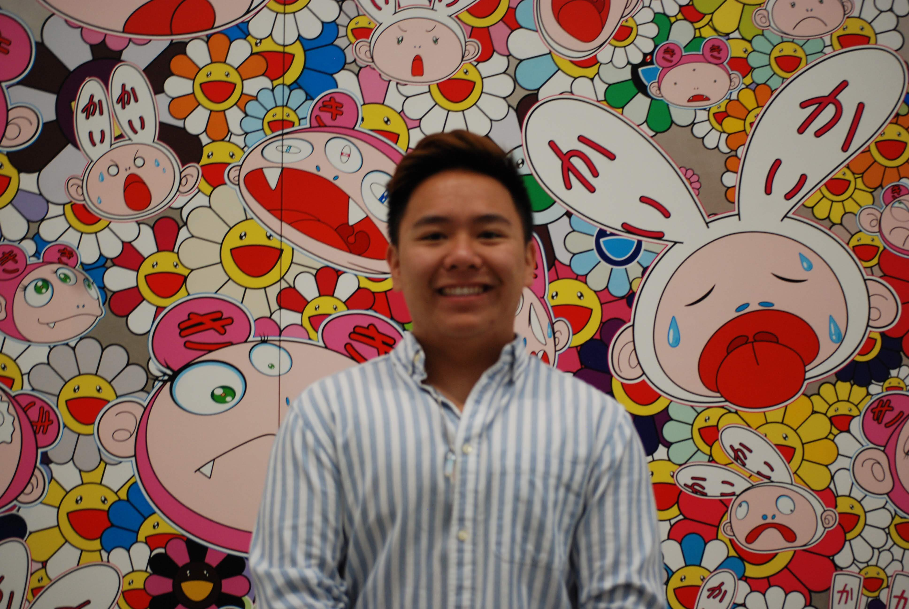

# Andrew's Github User Page

Here's where you can find my [LinkedIn](https://www.linkedin.com/in/ngoandrew00/).

## [Programming](https://github.com/ngoandrew)
My personal philosophy when it comes to programming can be succintly described using a lyric from one of the greatest lyrical geniuses of our time, ~~Grimes~~ Charli XCX:
> Vroom vroom

The first line of code I ever learned was:
```
  System.out.println("Hello world!");
```
The languages I know best are:
1. C++
2. Java
3. Python

Some things I want to learn more about:
- [ ] Machine learning
- [ ] Cybersecurity
- [ ] Computer graphics

## More about me
Here are some of my favorite artists:
- Rina Sawayama
- Sufjan Stevens
- Carly Rae Jepsen

I've got something to tell [you](message.txt).
